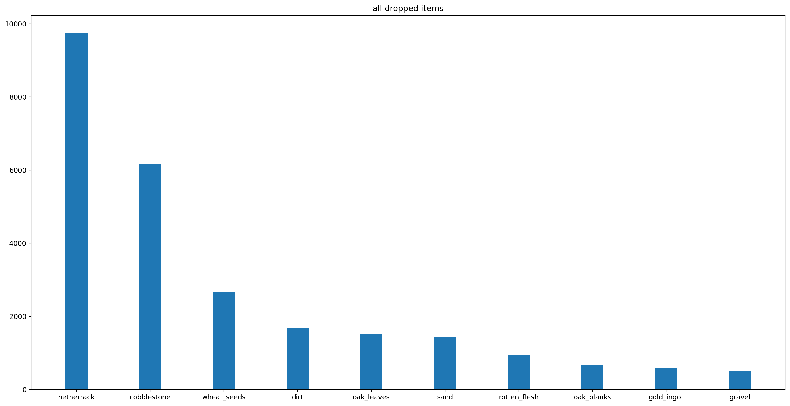
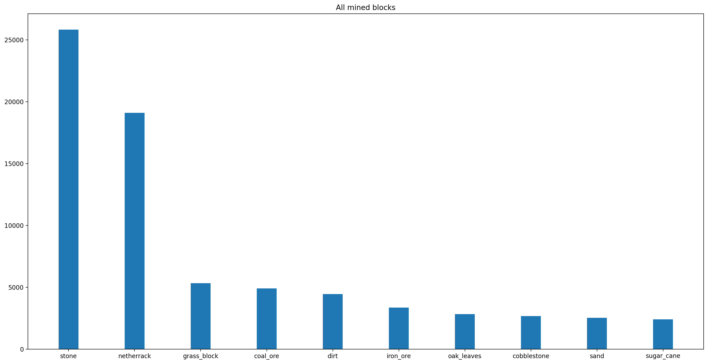

    

# Minecraft Stats Analyzer 

  

Tool to create graphs and analyze Minecraft stats

**See a quick demo of the cli application part of this project [over here](https://asciinema.org/a/447891)**   
*Along with the charts:*

  

--------------------------------------------------
**With this project, I'll experiment a little, and upload every single idea, plan, schedule, etc. associated with said project.**  
[You can see that over here](.history/history.md)
